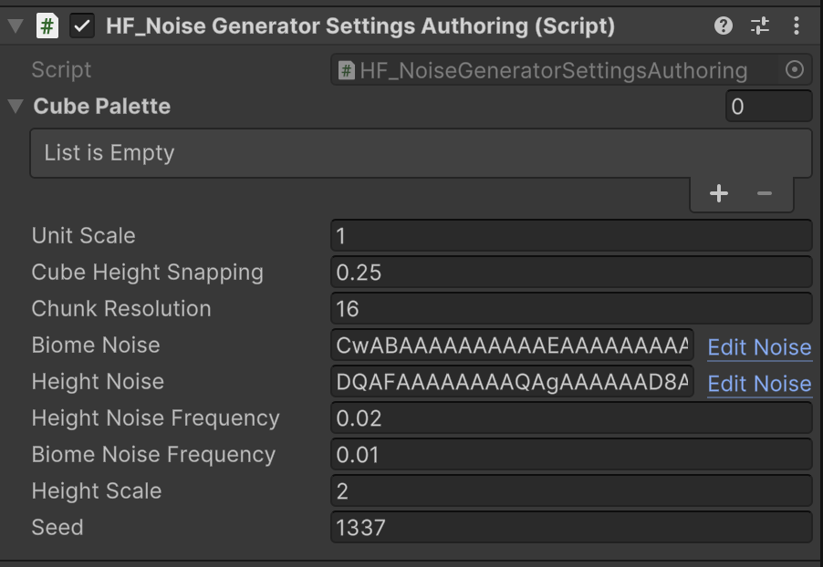

> [FastNoise2 by Auburn](https://github.com/Auburn/FastNoise2) packaged in UPM

Platform support:

* Linux, Android
* macos Universal
* Windows

Feature support:

* `NativeTextureXD<T>`
* Burst/Jobs/IL2CPP compatible FN2 bindings
* GenNoiseXD Jobs, NormalizeXD Job
* EditorProperty for FastNoiseGraph Serialized type with integrated NoiseTool support

TODO:

* Complete NoiseTool-Unity Integration (send Encoded Noise as NoiseTool launch argument)
* Documentation, examples. For now see [Tests](./Tests) for usage
